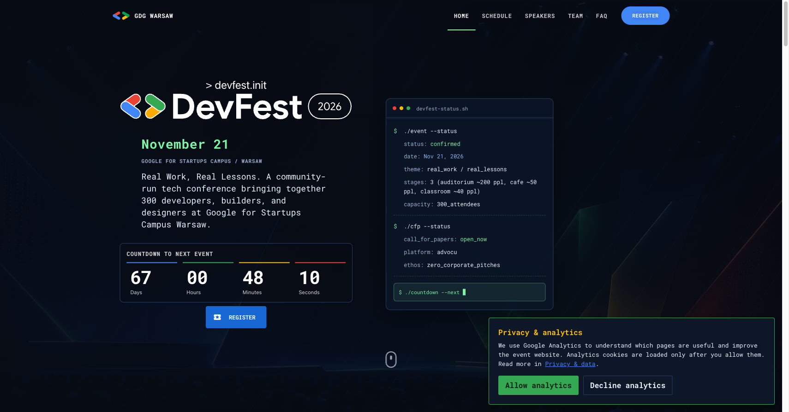

# GDG DevFest Warsaw 2026 — Official Website & Platform

<div align="center">

[](https://warsaw.devfest.pl/)
[](https://gdg-warsaw-devfest26-web.web.app/)
[](https://github.com/Jabolo/hoverboard/actions/workflows/main.yaml)
[](https://github.com/Jabolo/hoverboard/actions/workflows/deploy.yaml)

<br/>

[](https://gdg.community.dev/gdg-warszawa/)
[](https://lit.dev/)
[](https://www.typescriptlang.org/)
[](https://cloud.google.com/iam/docs/workload-identity-federation)
[](/LICENSE.md)

<br/>

<a href="https://warsaw.devfest.pl/">
  
</a>

<p align="center">
  <b>The official conference platform and ticketing integration powering DevFest Warsaw 2026.</b><br/>
  Organized by <a href="https://gdg.community.dev/gdg-warszawa/">GDG Warsaw</a> &bull; Nov 21, 2026 &bull; Google for Startups Campus Warsaw
</p>

</div>

---

## 🌐 Live Deployments & Year-Proof Links

- **Live Conference Domain (Active):** [https://warsaw.devfest.pl/](https://warsaw.devfest.pl/)
- **Permanent 2026 Immutable Link (Year-Proof Archive):** [https://gdg-warsaw-devfest26-web.web.app/](https://gdg-warsaw-devfest26-web.web.app/)  
  _(Alternative permanent alias: [`https://gdg-warsaw-devfest26-web.firebaseapp.com/`](https://gdg-warsaw-devfest26-web.firebaseapp.com/))_

> [!NOTE]
> **Archival Guarantee:** In subsequent years (e.g. DevFest 2027 and beyond), the primary domain `warsaw.devfest.pl` may rotate to point to the newest edition. The Firebase project `gdg-warsaw-devfest26-web.web.app` serves as the immutable, permanent record and living showcase of the 2026 conference edition and codebase.

---

## 🚀 Community Impact & Engineering Highlights

This repository is maintained by **Michał Jabłoński** (GDG Warsaw Organizer & Web Lead) as a community-driven production deployment and hardening of Project Hoverboard for the Warsaw developer community.

Key engineering contributions and platform enhancements include:

- **⚡ Instant 0ms Ticket Rendering:** Implemented local catalogue caching and static ticket fallback with multi-tab storage synchronization, eliminating Firestore cold-start layout shifts and rendering tickets instantaneously.
- **🎟 Seamless Evenea Checkout Integration:** Deep iframe integration passing official ticket parameter selection (`ticket[ID]=1`) with smooth scroll orchestration directly into the attendee registration checkout flow.
- **🔐 Zero-Secret Keyless CI/CD:** Fully automated deployment pipeline utilizing **GCP Workload Identity Federation** via GitHub Actions — eliminating long-lived service account keys and preventing credential leaks.
- **🛡 Enterprise-Grade Security & Headers:** Configured strict Content Security Policy (CSP), HTTP Strict Transport Security (HSTS), frame guards, and nosniff protection in Firebase Hosting.
- **📈 Automated SEO Prerendering:** Custom static page generation pipeline ensuring optimal search engine indexing, rich OpenGraph social share previews, and fast edge delivery.
- **♿ Accessibility & Mobile-First UX:** WCAG compliance fixes, keyboard navigation support, and responsive layouts tailored for attendees on venue WiFi and mobile devices.

---

## 📁 Repository Branches

- **`main`**: Active production codebase for DevFest Warsaw 2026.
- **`archive/devfest-2023`**: Preserved historical baseline and codebase for DevFest Warsaw 2023.
- **`devfest-2026-legacy`**: Reference branch for earlier 2026 iterations.

---

## 🛠 Local Development & Setup

### Prerequisites

- Node.js `22`
- npm `10`
- Firebase CLI (`npm i -g firebase-tools`)

### Getting Started

```bash
# Clone the repository
git clone https://github.com/Jabolo/hoverboard.git
cd hoverboard

# Install dependencies
npm ci

# Start local development server with hot-reload
npm start
```

### Production Build & Linting

```bash
# Lint code and types
npm run lint

# Production build & static prerender
npm run build
```

---

## 🏗 Built on Project Hoverboard

This project is built on and contributes back to [`gdg-x/hoverboard`](https://github.com/gdg-x/hoverboard), the open-source conference website template created by the GDG community.

<details>
<summary><b>View upstream Hoverboard details & features</b></summary>

### Overview

Project Hoverboard is the conference website template that helps you to set up a mobile-first conference website with blog, speaker, and schedule management.

The template was created based on the [GDG Lviv](https://www.meetup.com/GDG-Lviv/) team experience and feedback from more than 500 event organizers worldwide.

### Core Features

| Feature                 | Description                                                |
| ----------------------- | ---------------------------------------------------------- |
| **Fast & optimized**    | High Lighthouse score PWA with client-side caching         |
| **Works offline**       | Resilient offline caching for venue environments           |
| **Mobile-first**        | Layouts optimized for small screens and installable as PWA |
| **Speakers & schedule** | Dynamic Firebase-backed schedule and speaker data          |
| **Customizable theme**  | Clean modern theming and styling                           |

### Upstream Authors & Maintainers

- **Maintainer:** [Abraham Williams](https://github.com/abraham)
- **Authors:** [Oleh Zasadnyy](https://github.com/ozasadnyy) and [Sophie Huts](https://github.com/sophieH29)

</details>

---

## 📄 License

The project is published under the [MIT license](/LICENSE.md).  
_GDG[x] is not endorsed and/or supported by Google, the corporation._
